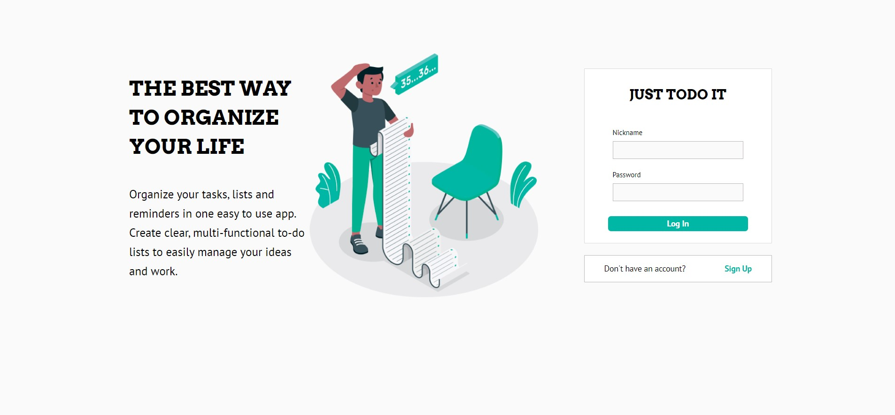

Project coded by:  [Vitaly Pinchuk](https://www.linkedin.com/in/vitaly-pinchuk-845182200/).  
BackEnd for project coded by:  [NIkita Nikolskiy](https://github.com/Nikita27142914).  
BackEnd:  [Link](https://github.com/Nikita27142914/fe_api).  

## About
Multipage Task Scheduler.The application allows you to view tasks, set new tasks, delete completed tasks and edit existing tasks. Two roles are available to users: User and Administrator 
Aplication develop with use -  **React, Redux, React-Router-Dom.**
Users can:  
* view received tasks  
* search tasks  
* check complited tasks
***
Administrators can:  
* view a list of their users  
* view tasks for each of their users  
* add new tasks to a user  
* edit tasks for a user  
* delete completed tasks  
***
Administrators also have the access to:  
* search among their users  
* search among user tasks  
*** 
In the application, tasks and users are displayed by pagination
***  
SignIn page in app.

